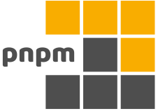
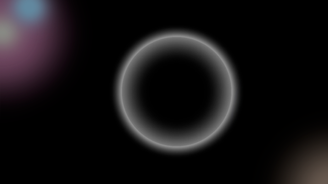

<h1>FOCKUSTY</h1>

Russian
[English](./langs/README.en.md)

<h2 align="left">Обо мне</h2>

    
        Меня зовут ?????, на август 2024 года мне 15 лет. Почему я начал изучать программирование? Всё просто, я просто начал, по приколу, да, вот такой вот я
    
     
    
        Мой первый язык - JavaScript, сначала я изучал HTML & CSS (Все мы знаем, что они не ЯП), а потом переключился на js
    
     
    
        Я нашёл свой интерес в программировании. Раньше я снимал видео на платформу YouTube, но мне в один момент надоело и я начал изучать веб. Я начал изучать программирование с 13 лет (2023 год в июне) 
    
     
    
        Я делал этот REAME.md 1 час 37 минут (+2,5 часа на обновление)
    

<h3 align="left">Социальные сети</h3>

| Главный           | Discord                                                                                                                                                                       | Telegram                                                                                                                                                                   | Vk                                                                                                             | Другие...                                                                                                                                |
| ----------------- | ----------------------------------------------------------------------------------------------------------------------------------------------------------------------------- | -------------------------------------------------------------------------------------------------------------------------------------------------------------------------- | -------------------------------------------------------------------------------------------------------------- | ---------------------------------------------------------------------------------------------------------------------------------------- |
| <h3>The Void</h3> |  |  |  | 
-
                                                                                                              |
| <h3>FOCKUSTY</h3> | #FOCKUSTY                                                                                                                                                                     |            |       |  |

<h3 align="right">Статы</h3>

<h3 align="left">Топ языков</h3>

<h3 align="right">Стрик</h3>

---

<h2>Скилы</h2>

<h3>Языки программирования</h3>

| ЯП                                                                                                                                                                                                       | Оценка знаний                                                                                                                                                      | Используется мной?                                                  | Профили                                              |
| -------------------------------------------------------------------------------------------------------------------------------------------------------------------------------------------------------- | ------------------------------------------------------------------------------------------------------------------------------------------------------------------ | ------------------------------------------------------------------- | ---------------------------------------------------- |
|  | Хорошо знаю, основной язык программирования, могу строго типизировать даже его.                                                                                    | Обычно не используется в повседневной жизни                         | 
-
                          |
|                     | Надстройка над JavaScript, иногда кажется, что знаю даже лучше, чем основу, хорошо знаю типы и могу ими умело управлять                                            | Чаще всего пишу на нём                                              | Бэкенд, фронтенд, создание утилит, библиотек и ботов |
|                                              | Язык, который я не люблю, но могу почти свободно писать на нём, знания поверхностные для понимания кода, однако, как я упоминал ранее, могу на нём свободно писать | Обычно не использую, только по заказам и/или в работе с нейросетями | Создание ботов                                       |
|                                                         | Поверхностные знания для понимания кода                                                                                                                            | Не использую                                                        | 
-
                          |
|                                                    | Поверхностные знания для понимания кода, могу написать вывод чего-то в консоль                                                                                     | Не использую, только тогда, когда хочется чего-то по сложнее        | Обучение (изредка)                                   |
|                                                              | В процессе обучения, могу писать небольшие программы и сервера                                                                                                     | Обучаюсь                                                            | Обучение, бэкенд                                     |

<h3>Технологии</h3>

<h4>Основа</h4>

| Технология:                 | Технология№1                                                                                                                                                                                                        | №2                                                                                                                                                                                                                                                                                                                                  | №3                                                                                                                                                                               |
| --------------------------- | ------------------------------------------------------------------------------------------------------------------------------------------------------------------------------------------------------------------- | ----------------------------------------------------------------------------------------------------------------------------------------------------------------------------------------------------------------------------------------------------------------------------------------------------------------------------------- | -------------------------------------------------------------------------------------------------------------------------------------------------------------------------------- |
| <h4>Пакетные менеджеры</h4> |                                                       | <a href="https://pnpm.io" title="pnpm"><picture><source media="(prefers-color-scheme: dark)" srcset="https://pnpm.io/assets/images/pnpm-light-477811893d2e1c4ad4b10345c442282e.svg" height="50px" ></picture></a> |                                |
| <h4>Работа с Git</h4>       |                                                    |                                                                                                      |  |
| <h4>Редакторы кода</h4>     |  |                                                                                                                                               | **
-
**                                                                                                                                                  |
| <h4>Другое</h4>             |                                          | **
-
**                                                                                                                                                                                                                                                                                                     | **
-
**                                                                                                                                                  |

<h4>Фронтенд</h4>

| Технология                                                                                                                                                                                                                        | Оценка знаний                                                                            | Используется мной?                 |
| --------------------------------------------------------------------------------------------------------------------------------------------------------------------------------------------------------------------------------- | ---------------------------------------------------------------------------------------- | ---------------------------------- |
|                                                                 | Поверхностные знания, могу писать неплохие небольшие клиенты с неплохой интерактивностью | Когда клиент должен быть небольшой |
|  | Поверхностные знания, см. React                                                          | Большие проекты                    |
|                                                                   | Просто знаком                                                                            | Не использую                       |
|                                                                     | Просто знаком                                                                            | Не использую                       |
| **Дополнительно**                                                                                                                                                                                                                 | 
-
                                                              | 
-
        |
|             | Использовал однажды                                                                      | Когда нужны иконки                 |

<h4>Бэкенд</h4>

| Технология                                                                                                                                                                                                                                   | Оценка знаний                                                                                            | Используется мной?                                           |
| -------------------------------------------------------------------------------------------------------------------------------------------------------------------------------------------------------------------------------------------- | -------------------------------------------------------------------------------------------------------- | ------------------------------------------------------------ |
|  | Хорошо знаю, могу писать неплохие сервера с хорошим Rest API                                             | Когда нужен небольшой и простой сервер                       |
|                                                                          | Понимаю, обучаюсь, могу писать неплохие сервера и, возможно, с хорошей документацией (пока что обучаюсь) | Когда нужен немаленький сервер с хорошим API и документацией |
| **Дополнительно**                                                                                                                                                                                                                            | 
-
                                                                              | 
-
                                  |
|                                                                | Хорошо знаю, могу писать утилиты для удобной авторизации с разных источников                             | Когда нужна авторизация                                      |

<h4>Базы данных</h4>

| Технология                                                                                                                                                                                                                                 | Оценка знаний                                                                                         | Используется мной?          |
| ------------------------------------------------------------------------------------------------------------------------------------------------------------------------------------------------------------------------------------------ | ----------------------------------------------------------------------------------------------------- | --------------------------- |
|  | Способен делать неплохие запросы к БД, знаю поверхностно, обычно не применяю                          | Обычно не применяю          |
|                                                           | Могу писать удобные утилиты с хорошей типизацией, чаще всего использую из-за удобного MongoDB Compass | Чаще всего использую        |
| **Дополнительно**                                                                                                                                                                                                                          | 
-
                                                                           | 
-
 |
|                                                          | Знаю поверхностно, но могу писать удобные утилиты                                                     | Обычно не применяю          |

<h4>Деплой</h4>

| Технология                                                                                                                                                                                                                                                   | Оценка знаний                                              | Используется мной?                                                                      |
| ------------------------------------------------------------------------------------------------------------------------------------------------------------------------------------------------------------------------------------------------------------ | ---------------------------------------------------------- | --------------------------------------------------------------------------------------- |
|                                                                                  | Настройка netlify functions (без конфига) и обычный деплой | Когда использую React, Next и другие фреймворки/библиотеки (то есть не обычный html-js) |
|  | Просто знаком, иногда выставлял сюда простые сайты-утилиты | Когда сайт создан без фреймворков и/или библиотек: стандартные html-js                  |
|                        | Просто знаком, никак не могу зарегистрироваться            | Нет                                                                                     |

<h4>Социальные сети</h4>

| Соцсеть                                                                                                                                                              | Используется мной?                                                                                     |
| -------------------------------------------------------------------------------------------------------------------------------------------------------------------- | ------------------------------------------------------------------------------------------------------ |
|       | Чаще всего используется мной, обычно зависаю там: общаюсь и говорю с разными людьми                    |
|      | Начал сидеть там после блокировки Discord на территории РФ. Стараюсь вести канал                       |
|                                                           | Просто социальная сеть, где я читаю про чужие жизни и стебусь над ними (в хорошем смысле, им нравится) |
|                                                                      | Я тут слушаю музыку, давайте со мной                                                                   |
|  | Ну... иногда захожу...                                                                                 |

---

